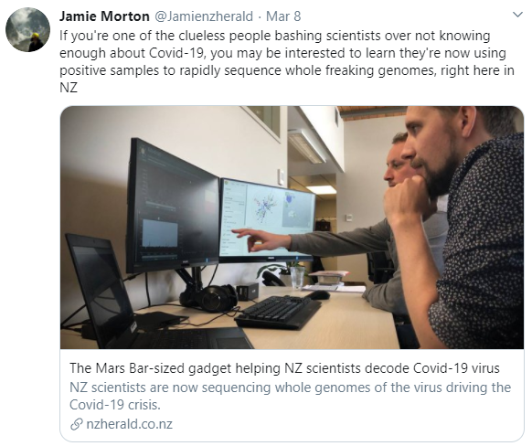
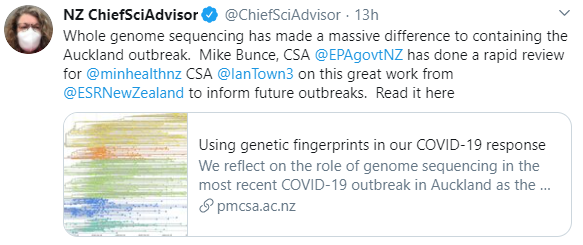

class: middle hide_logo

```{r setup, include=FALSE}
options(htmltools.dir.version = FALSE)
options(knitr.table.format = "html") 
# require(DT)
xaringanExtra::use_xaringan_extra(c("tile_view", "animate_css", "tachyons", "panelset"))
```

```{r xaringan-logo, echo=FALSE}
# use logo
xaringanExtra::use_logo(
  image_url = "https://upload.wikimedia.org/wikipedia/commons/6/66/ESR_SFC_logo.png",
  width = "138px",
  height = "87px",
  position = xaringanExtra::css_position(bottom = "1px", right = "1.5em"),
  link_url = "https://www.esr.cri.nz/",
  exclude_class = c("title-slide", "inverse", "hide_logo")
)
```

# .center[Advocates for reproducible research...]

## .center[Where possible all presentations and code are available online]

<br />

<p>
.center[


]
</p>

<br />

.center[[sirselim.github.io/presentations](http://sirselim.github.io/presentations)]

<!-- SVG Icons are from https://simpleicons.org -->
<footer class="pv3 ph3 ph5-ns tc">
  <a class="link near-black hover-blue dib h2 w2 mr3" href="https://github.com/sirselim" title="GitHub">
    <svg fill="currentColor" xmlns="http://www.w3.org/2000/svg" viewBox="0 0 16 16" fill-rule="evenodd" clip-rule="evenodd" stroke-linejoin="round" stroke-miterlimit="1.414"><path d="M8 0C3.58 0 0 3.582 0 8c0 3.535 2.292 6.533 5.47 7.59.4.075.547-.172.547-.385 0-.19-.007-.693-.01-1.36-2.226.483-2.695-1.073-2.695-1.073-.364-.924-.89-1.17-.89-1.17-.725-.496.056-.486.056-.486.803.056 1.225.824 1.225.824.714 1.223 1.873.87 2.33.665.072-.517.278-.87.507-1.07-1.777-.2-3.644-.888-3.644-3.953 0-.873.31-1.587.823-2.147-.083-.202-.358-1.015.077-2.117 0 0 .672-.215 2.2.82.638-.178 1.323-.266 2.003-.27.68.004 1.364.092 2.003.27 1.527-1.035 2.198-.82 2.198-.82.437 1.102.163 1.915.08 2.117.513.56.823 1.274.823 2.147 0 3.073-1.87 3.75-3.653 3.947.287.246.543.735.543 1.48 0 1.07-.01 1.933-.01 2.195 0 .215.144.463.55.385C13.71 14.53 16 11.534 16 8c0-4.418-3.582-8-8-8"/></svg>
  </a>
  <a class="link hover-blue near-black dib h2 w2 mr3" href="https://twitter.com/miles_benton" title="Twitter">
    <svg fill="currentColor" xmlns="http://www.w3.org/2000/svg" viewBox="0 0 16 16" fill-rule="evenodd" clip-rule="evenodd" stroke-linejoin="round" stroke-miterlimit="1.414"><path d="M16 3.038c-.59.26-1.22.437-1.885.517.677-.407 1.198-1.05 1.443-1.816-.634.375-1.337.648-2.085.795-.598-.638-1.45-1.036-2.396-1.036-1.812 0-3.282 1.468-3.282 3.28 0 .258.03.51.085.75C5.152 5.39 2.733 4.084 1.114 2.1.83 2.583.67 3.147.67 3.75c0 1.14.58 2.143 1.46 2.732-.538-.017-1.045-.165-1.487-.41v.04c0 1.59 1.13 2.918 2.633 3.22-.276.074-.566.114-.865.114-.21 0-.416-.02-.617-.058.418 1.304 1.63 2.253 3.067 2.28-1.124.88-2.54 1.404-4.077 1.404-.265 0-.526-.015-.783-.045 1.453.93 3.178 1.474 5.032 1.474 6.038 0 9.34-5 9.34-9.338 0-.143-.004-.284-.01-.425.64-.463 1.198-1.04 1.638-1.7z" fill-rule="nonzero"/></svg>
  </a>
  <a class="link hover-blue near-black dib h2 w2 mr3" href="https://scholar.google.co.nz/citations?user=iEhBavEAAAAJ&hl=en" title="Google Scholar">
    <svg fill="currentColor" xmlns="http://www.w3.org/2000/svg" viewBox="0 0 24 24" fill-rule="evenodd" clip-rule="evenodd" stroke-linejoin="round" stroke-miterlimit="1.414"><path d="M12 24a7 7 0 1 1 0-14 7 7 0 0 1 0 14zm0-24L0 9.5l4.838 3.94A8 8 0 0 1 12 9a8 8 0 0 1 7.162 4.44L24 9.5z" fill-rule="nonzero"/></svg>
  </a>
  <a class="link hover-blue near-black dib h2 w2 mr3" href="http://orcid.org/0000-0003-3442-965X" title="ORCID">
    <svg fill="currentColor" xmlns="http://www.w3.org/2000/svg" viewBox="0 0 24 24" fill-rule="evenodd" clip-rule="evenodd" stroke-linejoin="round" stroke-miterlimit="1.414"><path d="M12 0C5.372 0 0 5.372 0 12s5.372 12 12 12 12-5.372 12-12S18.628 0 12 0zM7.369 4.378c.525 0 .947.431.947.947s-.422.947-.947.947a.95.95 0 0 1-.947-.947c0-.525.422-.947.947-.947zm-.722 3.038h1.444v10.041H6.647V7.416zm3.562 0h3.9c3.712 0 5.344 2.653 5.344 5.025 0 2.578-2.016 5.025-5.325 5.025h-3.919V7.416zm1.444 1.303v7.444h2.297c3.272 0 4.022-2.484 4.022-3.722 0-2.016-1.284-3.722-4.097-3.722h-2.222z" fill-rule="nonzero"/></svg>
  </a>
</footer>


---
class: top

# Genomics in NZ's pandemic response

### A sequencing success story made possible by the awesome <span style="color:#3498DB"><b>Una Ren</b></span> & <span style="color:#3498DB"><b>Matt Storey</b></span>

<article class="cf">
  <div class="fl w-50 bg-white tc">
    
  </div>
  <div class="fl w-40 bg-white tc">
    <p style="text-align:center"> Give us some time and money and we'll demonstrate what this technology can do. <br /> . <br /> . <br /> </p>
  </div>
  
  <div class="fl w-40 bg-white tc">
    
  </div>
</article>


---

# Rapid genomes are needed for rapid descision making

### For urgent samples it can be turned around in <span style="color:#3498DB"><b>~8 hours</b></span>

<b>Robust & rapid sample preparation protocols</b>
- [ARTIC consortium](https://www.protocols.io/view/ncov-2019-sequencing-protocol-v3-locost-bh42j8ye)
- [Massey](https://www.protocols.io/view/ncov-2019-sequencing-protocol-rapid-barcoding-1200-bh7hj9j6) Nikki Freed & Olin Silander 

<b>Rapid sequencing + rapid analysis</b>
- Oxford Nanopore sequencing
- GPU enabled basecalling while sequencing

<br />

<span style="color:#3498DB"><b>And it's that last part where we want to spend some more time on.</b></span>


---
class:top

# Rapid genomics results are useful outside of a pandemic

<br />

### Where else are these technologies having an impact?

<br />

### And how can we unlock this potential for everyone?

---

class: top

# More of our awesome people

<div class="dt dt--fixed">
  <div class="dtc tc pv4 bg-white">
    <article class="mw5 center bg-white br3 pa3 pa4-ns mv3 ba b--black-10">
      <div class="tc">
        
        <h4 class="f3 mb2">Leah Kemp</h4>
        <h4 class="f5 fw4 gray mt0">(ESR)</h4>
      </div>
    </article>
  </div>
  <div class="dtc tc pv4 bg-white">
    <article class="mw5 center bg-white br3 pa3 pa4-ns mv3 ba b--black-10">
      <div class="tc">
        
        <h4 class="f3 mb2">Joep de Ligt</h4>
        <h4 class="f5 fw4 gray mt0">(ESR)</h4>
      </div>
    </article>
  </div>
  <div class="dtc tc pv4 bg-white">
    <article class="mw5 center bg-white br3 pa3 pa4-ns mv3 ba b--black-10">
      <div class="tc">
        
        <h4 class="f3 mb2">Donia Macartney-Coxson</h4>
        <h4 class="f5 fw4 gray mt0">(ESR)</h4>
      </div>
    </article>
  </div>
</div>

---

# A snapshot of the Human Genomics group

* **Independent research**

<br>

* **Clinical diagnostics through genetics**
  * Contract(s) with CCDHB Wellington Regional Genetics Lab
  * Providing support to CCDHB for Clinical Genomics GA project (<span style="color:#3498DB"><b>Stephen Robertson</b></span>)

<br>

* **Clinical research**, in collaboration with local clinician (<span style="color:#3498DB"><b>Richard Carroll</b></span>) - hyperparathyroidism
  * sequencing 100 exomes
  * engaging clinicians from other DHBs
  * exploring the replacement of gene panels with exome/genome

---
class: top

# Overhaul of pipelines

<br>

<article class="cf">
  <div class="fl w-100 w-50-ns bg-white">
    <br>
    <br>
    <br>
    <ul>
      <li>Alignment and Variant Calling Workflow</li>
        <ul>
          <li><a href="https://github.com/ESR-NZ/human_genomics_pipeline" target="blank">[human_genomics_pipeline]</a></li>
        </ul>
    <br>
    <br>
      <li>Variant Annotation Workflow</li> 
        <ul>
          <li><a href="https://github.com/ESR-NZ/vcf_annotation_pipeline" target="blank">[annotation_pipeline]</a></li>
        </ul>
    </ul>
  </div>
  <div class="fl w-100 w-50-ns bg-white tc">
  <article class="mw5 center bg-white br3 pa3 pa4-ns mv3 ba b--black-10">
    <div class="tc">
      
      <h4 class="f3 mb2">Leah Kemp</h4>
      <h4 class="f5 fw4 gray mt0">(ESR)</h4>
    </div>
  </article>
  </div>
</article>

.center[.huge[ESR GitHub: [https://github.com/ESR-NZ](https://github.com/ESR-NZ)]]

---
class: top

# Now to speed things up!

<b>Thanks to eResearch 2020<b> ...enter [Nvidia Clara Parabricks](https://www.nvidia.com/en-us/docs/parabricks/)

<article class="cf">
  <div class="fl w-50 bg-white tc">
    
  </div>
  <div class="fl w-50 bg-white tc">
    
  </div>
</article>

.center[<span style="color:#3498DB"><b> powered by GPU </b></span>]

.center[]

---
class: middle

.center[

]

<br>

.center[[www.nvidia.com/en-us/healthcare/clara-parabricks/](https://www.nvidia.com/en-us/healthcare/clara-parabricks/)]


---

# How much does that matter?

### Identical pipelines with a slight difference...

<article class="cf">
  <div class="fl w-100 w-50-ns bg-white">
    <ul>
    <li><b>Pipeline [CPU]</b></li>
      <ul>
        <li>Exomes: >100X exome takes between 8-12 hours</li>
        <li>Genomes: ~30X genome takes between 30-48 hours</li>
      </ul>
    </ul>
    <br>
    <ul>
    <li><b>Pipeline [GPU - Parabricks]</b></li>
      <ul>
        <li>Exomes: >100X exome takes between <span style="color:#3498DB"><b>6-12 mins</b></span></b></li>
        <li>Genomes: 100X genome takes <span style="color:#3498DB"><b>~4 hours</b></span></li>
      </ul>
    </ul>
  </div>
  <div class="fl w-100 w-50-ns bg-white tc">
    
  </div>
</article>


---
class: middle

# GPUs accelerate basecalling of Nanopore long-read data (a lot)

.center[

]

<br>

.center[
Nanopore basecalling benchmarking: [link (ESR GitHub)](https://esr-nz.github.io/gpu_basecalling_testing/gpu_benchmarking.html)
]

---

# So how about unlocking it for everyone?

.center[

]

---

# The unboxing and a slight snag

<article class="cf">
  <div class="fl w-50 bg-white tc">
    
  </div>
  <div class="fl w-50 bg-white tc">
    
  </div>
</article>

---

# Success

<article class="cf">
  <div class="fl w-50 bg-white tc">
    
  </div>
  <div class="fl w-40 bg-white tc">
    
  </div>
  <div class="fl w-40 bg-white tc">
    
  </div>
</article>

---

# The Future...

.center[

]

.center[

]

---

# The (not so distant) future...

<article class="cf">
  <div class="fl w-50 bg-white tc">
    
  </div>
  <div class="fl w-50 bg-white tc">
    
  </div>
</article>

.center[

]

---

## Our experiences with the Jeston Xaviers

#### eResearch 2020 presentation 
  * [Assessing the potential of ~~autonomous AI devices~~ cool tech for portable real-time sequencing](https://sirselim.github.io/presentations/eResearch_2020/eResearch_presentation_livedemo_2020#1)
    * live base-calling and presentation run from the Xavier

<br>

#### Xavier AGX setup and notes
  * [Xavier AGX unboxing and setup](https://hackmd.io/@Miles/HkumH7sBH)

<br>

#### Xavier base-calling benchmarking and notes
  * [Xavier benchmarking](https://gist.github.com/sirselim/2ebe2807112fae93809aa18f096dbb94#file-basecalling_notes-md)

---

class: middle hide_logo

<article class="center mw5 mw6-ns br3 hidden ba b--black-10 mv4">
  <h1 class="f4 bg-near-white br3 br--top black-60 mv0 pv2 ph3">Thank you</h1>
  <div class="pa3 bt b--black-10">
    <p class="f6 f5-ns lh-copy measure">
      Thank you for your time today, any questions?
    </p>
  </div>
</article>
